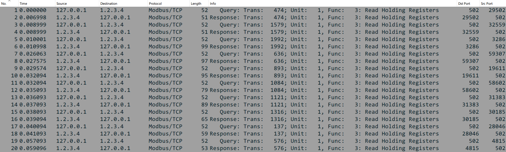

# Modbus Traffic Generator

Инструмент позволяет генерировать трафик Modbus, используя модуль [Scapy](https://github.com/secdev/scapy) на [Python3](https://github.com/python/cpython).

## Как использовать

Откройте код в командной строке или любом удобном для вас редакторе, поддерживающем [Jupyter Notebook](https://docs.jupyter.org/en/latest/#what-is-a-notebook).  
Для выполнения через командную строку, используйте:

    ipython3 Scapy-Modbus-Generator.ipynb

В текстовом же редакторе можно изменить следующие параметры:  
**Адрес отправителя и получателя:**

    src_addr = 'localhost'  # Отправитель
    dst_addr = '1.2.3.4'    # Получатель

**Размер матрицы:**

    rows = 20  # Количество строк матрицы
    cols = 20  # Количество столбцов матрицы

**Размер трафика:**

    num_interactions = 2000  # Количество запросов
    max_num_registers = 25   # Максимальное количество регистров в каждом пакете

### Результат

В результате выполнения получится pcap-файл `modbus-interactions.pcap`, который можно найти в той же директории, из которой запускался код. Данный файл можно посмотреть и проанализировать через, например, [Wireshark](https://www.wireshark.org/).

## Требования

Для успешного запуска должны быть установлены модули [NumPy](https://github.com/numpy/numpy) и [Scapy](https://github.com/secdev/scapy):

    python3 -m pip install numpy
    python3 -m pip install scapy

## Авторы

> Илья Сабуров [@Ilya-Saburov](https://github.com/Ilya-Saburov)  
> Стригин Дмитрий [@PROUTEK8](https://github.com/PROUTEK8)  
> Александр Омелёхин [@sashawins](https://github.com/sashawins)  
> Григорий Иконников [@ghosthunt3r](https://github.com/ghosthunt3r)
